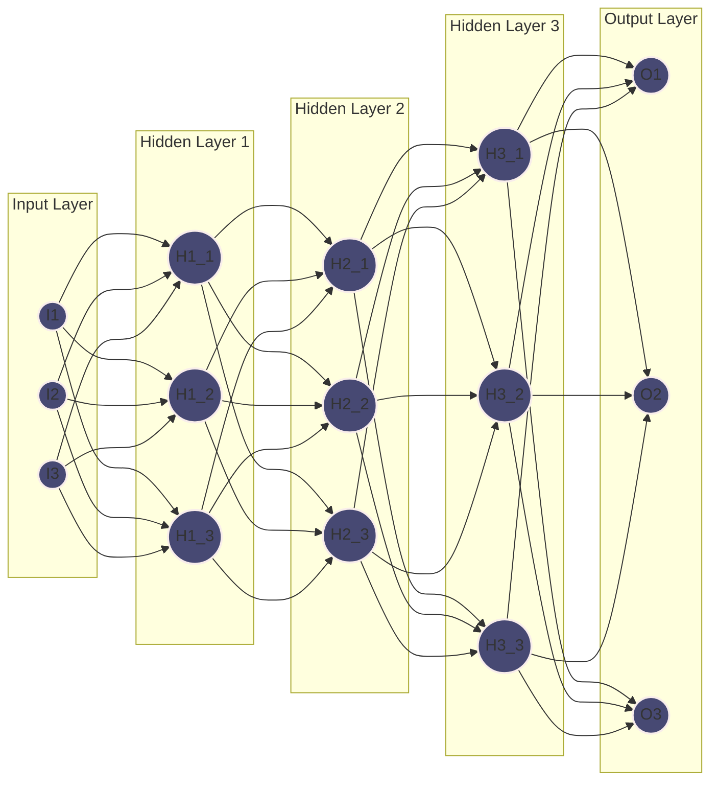
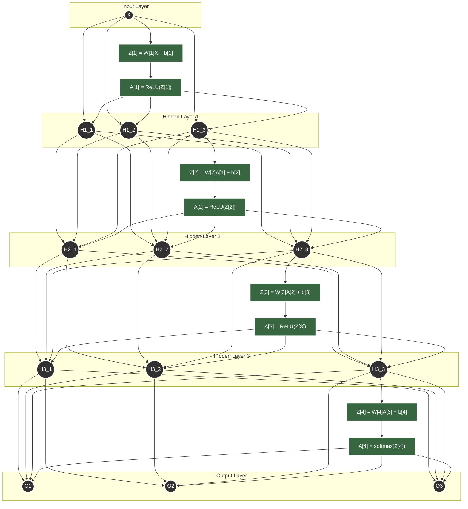
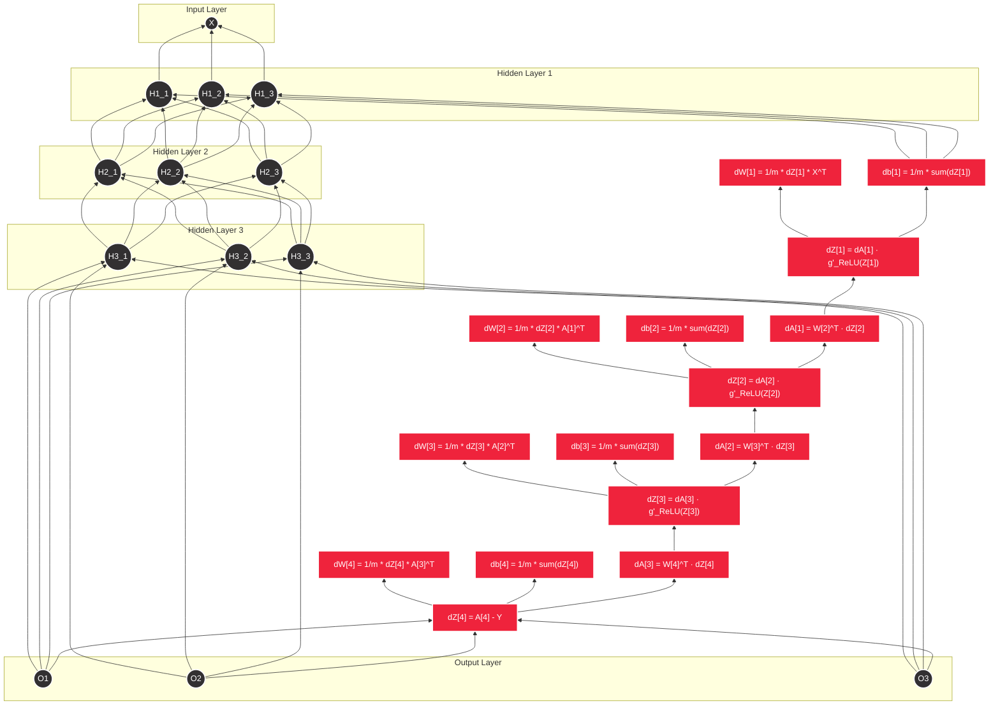

## Introduction

Artificial Neural Networks (ANNs) have revolutionized the field of machine learning, enabling breakthroughs in image recognition, natural language processing, and more. At the heart of training these networks lies a powerful algorithm: backpropagation. In this blog post, we'll demystify backpropagation, exploring its intuition, mechanics, and practical implementation.

You can find the code for this blog post [Neural Network From Scratch](https://github.com/ahammadnafiz/Machine-Learning/blob/main/Neural%20Netwoks/FizNet.py).

## 1. The Intuition Behind Backpropagation

### What is Backpropagation?
Backpropagation is like a game of telephone in reverse. Imagine you're at the end of a line of people, and you need to correct a message that got distorted along the way. You'd start by telling the person next to you what went wrong, and they'd pass that information back up the line, with each person making small adjustments based on their role in the distortion.

### Why is it Important?
Backpropagation allows neural networks to learn from their mistakes efficiently. It's the process that enables a network to adjust its internal parameters (weights and biases) to minimize the difference between its predictions and the actual outcomes.

## 2. The Mathematics of Learning

### Forward Pass: Making Predictions
We'll explore how information flows through the network, from input to output, using matrix multiplications and activation functions.

### Backward Pass: Learning from Errors
Here, we'll dive into how the network propagates errors backward and calculates gradients to update its parameters.

## 3. Step-by-Step Backpropagation Example

#### **1. Definitions and Notations**

Let’s define the notations for clarity:

- **L**: Total number of layers, where \( $L = N + 1$ \). (N hidden layers + 1 output layer).
- $n_l​$: Number of neurons in layer $l$, where $l=1,2,…,N+1$ (for N hidden layers and 1 output layer).
- **X**: Input data matrix of shape \($(n_x, m)$\), where:
  - $( n_x$): Number of input features.
  - $( m )$: Number of training examples.
- **Y**: True label matrix of shape \($(n_y, m)$\), where:
  - $( n_y )$: Number of output classes (e.g., 1 for binary classification, C for multiclass).
  - $( m)$: Number of training examples.
- **W[l]**: Weights matrix for layer \(l\), shape depends on layer dimensions.
- **b[l]**: Bias vector for layer \(l\), shape depends on layer dimensions.
- **Z[l]**: Linear transformation at layer \(l\).
- **A[l]**: Activation at layer \(l\).
- **g(·)**: Activation function (ReLU, softmax, etc.).
- **g′(·)**: Derivative of the activation function.
- **α**: Learning rate.

---
Summary of Shapes

Here $n_l$ is the current layer and $n_{l-1}$ is the previous layer.

| Layer | Variable | Shape            |

| ----- | -------- | ---------------- |
| 0     | $X$      | $(n_x, m)$       |
| l     | $W[l]$   | $(n_l, n_{l-1})$ |
| l     | $b[l]$   | $(n_l, 1)$       |
| l     | $Z[l]$   | $(n_l, m)$       |
| l     | $A[l]$   | $(n_l, m)$       |
| L     | $dZ[L]$  | $(n_y, m)$       |
| l     | $dZ[l]$  | $(n_l, m)$       |
| l     | $dW[l]$  | $(n_l, n_{l-1})$ |
| l     | $db[l]$  | $(n_l, 1)$       |
| L     | $dW[L]$  | $(n_y, n_N)$     |
| L     | $db[L]$  | $(n_y, 1)$       |

### **2. Forward Propagation (General Template)**

For **each hidden layer \( l = 1, 2, ..., N \)** and the output layer \( L = N+1 \), the forward pass involves the following steps:

1. **Linear Transformation**:
   
$$
   Z[l] = W[l]A[l-1] + b[l]
$$
   
   - ( $A[0] = X$ ) (the input layer).
   - ( $Z[l]$ \) is the linear output before applying the activation function.
   -  $W[l] \in \mathbb{R}^{n_l \times n_{l-1}}$, where:
     - ( $n_l$ \): Number of neurons in layer \( l \).
     - ( $n_{l-1}$ \): Number of neurons in the previous layer \( l-1 \).

2. **Activation Function**:
   
$$
   A[l] = g(Z[l])
$$
   
   - For hidden layers, typically use **ReLU**:
 
$$
     g_{\text{ReLU}}(Z^{[l]}) = \max(0, Z^{[l]})
$$

   - For the output layer, typically use **softmax** for classification:
 
$$
     A[L] = g_{softmax}(Z[L])
$$
 
 where \( $g_{softmax}(Z[L])$ \) is a vector of probabilities.

#### **Forward Pass Example for 3 Layers**:

1. **Input Layer → Hidden Layer 1**:
   
$$
   Z[1] = W[1]X + b[1], \quad A[1] = g_{\text{ReLU}}(Z[1])
$$
   
   
2. **Hidden Layer 1 → Hidden Layer 2**:
   
$$
   Z[2] = W[2]A[1] + b[2], \quad A[2] = g_{\text{ReLU}}(Z[2])
$$
   

3. **Hidden Layer 2 → Output Layer**:
   
$$
   Z[3] = W[3]A[2] + b[3], \quad A[3] = g_{softmax}(Z[3])
$$
   

---

### **3. Backward Propagation (General Template)**

Backward propagation starts from the output layer and moves toward the input layer, updating the gradients of weights and biases using the chain rule.

```mermaid
graph RL
    subgraph "Input Layer"
        I1((I1))
        I2((I2))
        I3((I3))
    end
    subgraph "Hidden Layer 1"
        H1_1((H1_1))
        H1_2((H1_2))
        H1_3((H1_3))
    end
    subgraph "Hidden Layer 2"
        H2_1((H2_1))
        H2_2((H2_2))
        H2_3((H2_3))
    end
    subgraph "Hidden Layer 3"
        H3_1((H3_1))
        H3_2((H3_2))
        H3_3((H3_3))
    end
    subgraph "Output Layer"
        O1((O1))
        O2((O2))
        O3((O3))
    end
    O1 & O2 & O3 --> H3_1 & H3_2 & H3_3
    H3_1 & H3_2 & H3_3 --> H2_1 & H2_2 & H2_3
    H2_1 & H2_2 & H2_3 --> H1_1 & H1_2 & H1_3
    H1_1 & H1_2 & H1_3 --> I1 & I2 & I3
    
    classDef backward fill:#354f52,stroke:#333,stroke-width:2px;
    class I1,I2,I3,H1_1,H1_2,H1_3,H2_1,H2_2,H2_3,H3_1,H3_2,H3_3,O1,O2,O3 backward;
```

#### **Step-by-Step Backward Propagation:**

For each layer \( l = L, L-1, ..., 1 \):

1. **Output Layer Gradient**:
   The loss gradient with respect to \( Z[L] \):
   
$$
   dZ[L] = A[L] - Y
$$
   
   - This is the difference between predicted probabilities and true labels.

2. **Gradients for Weights and Biases** (Layer \( L \)):
   
$$
   dW[L] = \frac{1}{m} dZ[L] A[L-1]^T
$$
   
   
$$
   db[L] = \frac{1}{m} \sum_{i=1}^{m} dZ[L]
$$
   

3. **Propagate the Error to the Previous Layer** (Hidden Layers):
   For each hidden layer \( l = N, N-1, ..., 1 \):
   
$$
   dZ[l] = W[l+1]^T dZ[l+1] \cdot g_{\text{ReLU}}(Z[l])
$$
   
   - Here  $g_{\text{ReLU}}(Z[l])$ is the derivative of the ReLU activation function:
 
$$
     g_{\text{ReLU}}(Z[l]) = \begin{cases}
     1 & \text{if } Z[l] > 0 \\
     0 & \text{if } Z[l] \leq 0
     \end{cases}
$$
 

4. **Gradients for Weights and Biases** (Hidden Layers):
   For each hidden layer \( l \):
   
$$
   dW[l] = \frac{1}{m} dZ[l] A[l-1]^T
$$
   
   
$$
   db[l] = \frac{1}{m} \sum_{i=1}^{m} dZ[l]
$$
   

#### **Backward Pass Example for 3 Layers**:
1. **Output Layer**:
   
$$
   dZ[3] = A[3] - Y, \quad dW[3] = \frac{1}{m} dZ[3] A[2]^T, \quad db[3] = \frac{1}{m} \sum_{i=1}^{m} dZ[3]
$$
   
   
2. **Hidden Layer 2**:
   
$$
   dZ[2] = W[3]^T dZ[3] \cdot g_{\text{ReLU}}(Z[2]), \quad dW[2] = \frac{1}{m} dZ[2] A[1]^T, \quad db[2] = \frac{1}{m} \sum_{i=1}^{m} dZ[2]
$$
   

3. **Hidden Layer 1**:
   
$$
   dZ[1] = W[2]^T dZ[2] \cdot g_{\text{ReLU}}(Z[1]), \quad dW[1] = \frac{1}{m} dZ[1] X^T, \quad db[1] = \frac{1}{m} \sum_{i=1}^{m} dZ[1]
$$
   

---

### **4. Parameter Updates (General Template)**

For each layer \( l = 1, 2, ..., L \), update the weights and biases using gradient descent:

1. **Weights Update**:
   
$$
   W[l] := W[l] - \alpha dW[l]
$$
   

2. **Biases Update**:
   
$$
   b[l] := b[l] - \alpha db[l]
$$
   

### **1. Initial Setup**

#### **Network Architecture**
- **Input Layer:** 3 neurons
- **Hidden Layer 1:** 3 neurons
- **Hidden Layer 2:** 3 neurons
- **Hidden Layer 3:** 3 neurons
- **Output Layer:** 3 neurons

#### **Input \( X \)** (3x1 matrix):

$$
X = \begin{bmatrix}
1  \\
4 \\
7 
\end{bmatrix}
$$

#### **Weights and Biases**

- **Weights for Hidden Layer 1 \( W[1] \)**:

$$
W[1] = \begin{bmatrix}
0.2 & -0.1 & 0.4 \\
0.5 & 0.3 & -0.6 \\
-0.2 & 0.1 & 0.3
\end{bmatrix}
$$

- **Bias for Hidden Layer 1 \( b[1] \)**:

$$
b[1] = \begin{bmatrix}
0 \\
0 \\
0
\end{bmatrix}
$$

- **Weights for Hidden Layer 2 \( W[2] \)**:

$$
W[2] = \begin{bmatrix}
0.1 & -0.2 & 0.5 \\
0.4 & 0.1 & -0.3 \\
-0.1 & 0.3 & 0.2
\end{bmatrix}
$$

- **Bias for Hidden Layer 2 \( b[2] \)**:

$$
b[2] = \begin{bmatrix}
0 \\
0 \\
0
\end{bmatrix}
$$

- **Weights for Hidden Layer 3 \( W[3] \)**:

$$
W[3] = \begin{bmatrix}
0.3 & 0.1 & -0.4 \\
0.2 & -0.5 & 0.6 \\
-0.3 & 0.2 & 0.4
\end{bmatrix}
$$

- **Bias for Hidden Layer 3 \( b[3] \)**:

$$
b[3] = \begin{bmatrix}
0 \\
0 \\
0
\end{bmatrix}
$$

- **Weights for Output Layer \( W[4] \)**:

$$
W[4] = \begin{bmatrix}
0.2 & -0.1 & 0.5 \\
0.4 & 0.1 & -0.3 \\
-0.2 & 0.3 & 0.2
\end{bmatrix}
$$

- **Bias for Output Layer \( b[4] \)**:

$$
b[4] = \begin{bmatrix}
0 \\
0 \\
0
\end{bmatrix}
$$

- **Target Output \( Y \)** (3x1 vector):

$$
Y = \begin{bmatrix}
1 \\
0 \\
0
\end{bmatrix}
$$

### **2. Forward Pass Calculation**

#### **Step 1: Calculate \( Z[1] \)** (Hidden Layer 1)

$$
Z[1] = W[1] X + b[1]
$$

Calculating:

$$
Z[1] = \begin{bmatrix}
0.2 & -0.1 & 0.4 \\
0.5 & 0.3 & -0.6 \\
-0.2 & 0.1 & 0.3
\end{bmatrix} \begin{bmatrix}
1 \\
4 \\
7
\end{bmatrix} + \begin{bmatrix}
0 \\
0 \\
0
\end{bmatrix}
$$

Calculating:

$$
Z[1] = \begin{bmatrix}
0.2 \cdot 1 - 0.1 \cdot 4 + 0.4 \cdot 7 \\
0.5 \cdot 1 + 0.3 \cdot 4 - 0.6 \cdot 7 \\
-0.2 \cdot 1 + 0.1 \cdot 4 + 0.3 \cdot 7
\end{bmatrix}
$$

Calculating each element:
1. $0.2 - 0.4 + 2.8 = 2.6$ 
2.  $0.5 + 1.2 - 4.2 = -2.5$ 
3.  $-0.2 + 0.4 + 2.1 = 2.3$ 

So,

$$
Z[1] = \begin{bmatrix}
2.6 \\
-2.5 \\
2.3
\end{bmatrix}
$$

#### **Step 2: Apply Activation Function \( A[1] \)**
Using ReLU:

$$
A[1] = g_{\text{ReLU}}(Z[1]) = \begin{bmatrix}
\max(0, 2.6) \\
\max(0, -2.5) \\
\max(0, 2.3)
\end{bmatrix} = \begin{bmatrix}
2.6 \\
0 \\
2.3
\end{bmatrix}
$$

#### **Step 3: Calculate \( Z[2] \)** (Hidden Layer 2)

$$
Z[2] = W[2] A[1] + b[2]
$$

Calculating:

$$
Z[2] = \begin{bmatrix}
0.1 & -0.2 & 0.5 \\
0.4 & 0.1 & -0.3 \\
-0.1 & 0.3 & 0.2
\end{bmatrix} \begin{bmatrix}
2.6 \\
0 \\
2.3
\end{bmatrix} + \begin{bmatrix}
0 \\
0 \\
0
\end{bmatrix}
$$

Calculating:

$$
Z[2] = \begin{bmatrix}
0.1 \cdot 2.6 + (-0.2) \cdot 0 + 0.5 \cdot 2.3 \\
0.4 \cdot 2.6 + 0.1 \cdot 0 + (-0.3) \cdot 2.3 \\
-0.1 \cdot 2.6 + 0.3 \cdot 0 + 0.2 \cdot 2.3
\end{bmatrix}
$$

Calculating each element:
1.  $0.26 + 0 + 1.15 = 1.41$
2. $1.04 + 0 - 0.69 = 0.35$
3.  $-0.26 + 0 + 0.46 = 0.20$

So,

$$
Z[2] = \begin{bmatrix}
1.41 \\
0.35 \\
0.20
\end{bmatrix}
$$

#### **Step 4: Apply Activation Function \( A[2] \)**
Using ReLU:

$$
A[2] = g_{\text{ReLU}}(Z[2]) = \begin{bmatrix}
\max(0, 1.41) \\
\max(0, 0.35) \\
\max(0, 0.20)
\end{bmatrix} = \begin{bmatrix}
1.41 \\
0.35 \\
0.20
\end{bmatrix}
$$

#### **Step 5: Calculate \( Z[3] \)** (Hidden Layer 3)

$$
Z[3] = W[3] A[2] + b[3]
$$

Calculating:

$$
Z[3] = \begin{bmatrix}
0.3 & 0.1 & -0.4 \\
0.2 & -0.5 & 0.6 \\
-0.3 & 0.2 & 0.4
\end{bmatrix} \begin{bmatrix}
1.41 \\
0.35 \\
0.20
\end{bmatrix} + \begin{bmatrix}
0 \\
0 \\
0
\end{bmatrix}
$$

Calculating:

$$
Z[3] = \begin{bmatrix}
0.3 \cdot 1.41 + 0.1 \cdot 0.35 - 0.4 \cdot 0.20 \\
0.2 \cdot 1.41 - 0.5 \cdot 0.35 + 0.6 \cdot 0.20 \\
-0.3 \cdot 1.41 + 0.2 \cdot 0.35 + 0.4 \cdot 0.20
\end{bmatrix}
$$

Calculating each element:
1. $0.423 + 0.035 - 0.08 = 0.378$ 
2. $0.282 - 0.175 + 0.12 = 0.227$
3. $-0.423 + 0.07 + 0.08 = -0.273$

So,

$$
Z[3] = \begin{bmatrix}
0.378 \\
0.227 \\
-0.273
\end{bmatrix}
$$

#### **Step 6: Apply Activation Function \( A[3] \)**
Using ReLU:

$$
A[3] = g_{\text{ReLU}}(Z[3]) = \begin{bmatrix}
\max(0, 0.378) \\
\max(0, 0.227) \\
\max(0, -0.273)
\end{bmatrix} = \begin{bmatrix}
0.378 \\
0.227 \\
0
\end{bmatrix}
$$

#### **Step 7: Calculate \( Z[4] \)** (Output Layer)

$$
Z[4] = W[4] A[3] + b[4]
$$

Calculating:

$$
Z[4] = \begin{bmatrix}
0.2 & -0.1 & 0.5 \\
0.4 & 0.1 & -0.3 \\
-0.2 & 0.3 & 0.2
\end{bmatrix} \begin{bmatrix}
0.378 \\
0.227 \\
0
\end{bmatrix} + \begin{bmatrix}
0 \\
0 \\
0
\end{bmatrix}
$$

Calculating:

$$
Z[4] = \begin{bmatrix}
0.2 \cdot 0.378 - 0.1 \cdot 0.227 + 0.5 \cdot 0 \\
0.4 \cdot 0.378 + 0.1 \cdot 0.227 - 0.3 \cdot 0 \\
-0.2 \cdot 0.378 + 0.3 \cdot 0.227 + 0.2 \cdot 0
\end{bmatrix}
$$

Calculating each element:
1.  $0.0756 - 0.0227 + 0 = 0.0529$
2.  $0.1512 + 0.0227 + 0 = 0.1739$
3.  $-0.0756 + 0.0681 + 0 = -0.0075$

So,

$$
Z[4] = \begin{bmatrix}
0.0529 \\
0.1739 \\
-0.0075
\end{bmatrix}
$$

#### **Step 8: Apply Final Activation Function (e.g., Softmax)**

Step 1: Calculate the Exponentials

We need to compute the exponentials of each element in \( Z[4] \):

$$
e^{Z[4]} = \begin{bmatrix}
e^{0.0529} \\
e^{0.1739} \\
e^{-0.0075}
\end{bmatrix}
$$

Calculating these values:
1. $e^{0.0529} \approx 1.0543$
2. $e^{0.1739} \approx 1.1904$
3. $e^{-0.0075} \approx 0.9925$

So,

$$
e^{Z[4]} \approx \begin{bmatrix}
1.0543 \\
1.1904 \\
0.9925
\end{bmatrix}
$$

Step 2: Calculate the Sum of the Exponentials

Now, calculate the sum:

$$
\text{sum} = 1.0543 + 1.1904 + 0.9925 \approx 3.2372
$$

Step 3: Compute the Softmax Probabilities

Now apply the softmax formula:

$$
\text{softmax}(Z[4]) = \frac{e^{Z[4]}}{\text{sum}} = \frac{1}{3.2372} \begin{bmatrix}
1.0543 \\
1.1904 \\
0.9925
\end{bmatrix}
$$

Calculating each component:

$$
\text{softmax}(Z[4]) = \begin{bmatrix}
\frac{1.0543}{3.2372} \\
\frac{1.1904}{3.2372} \\
\frac{0.9925}{3.2372}
\end{bmatrix}
$$

Calculating these values:
1. $frac{1.0543}{3.2372} \approx 0.3252$
2. $frac{1.1904}{3.2372} \approx 0.3685$
3. $frac{0.9925}{3.2372} \approx 0.3063$

Result

The softmax probabilities for \( Z[4] \) are approximately:

$$
\begin{bmatrix}
0.3252 \\
0.3685 \\
0.3063
\end{bmatrix}
$$

### **3. Backward Pass Calculation**

#### **Step 1: Calculate \( dZ[4] \)** (Output Layer)
Assuming the loss function is the mean squared error:

$$
dZ[4] = A[4] - Y
$$

If we calculate \( A[4] \) using softmax, let’s simplify by assuming:

$$
A[4] = Z[4]
$$

So,

$$
dZ[4] = \begin{bmatrix}
0.0529 \\
0.1739 \\
-0.0075
\end{bmatrix} - \begin{bmatrix}
1 \\
0 \\
0
\end{bmatrix} = \begin{bmatrix}
-0.9471 \\
0.1739 \\
-0.0075
\end{bmatrix}
$$

#### **Step 2: Calculate Gradients for Output Layer**
Calculating \( dW[4] \):

$$
dW[4] = \frac{1}{m} dZ[4] A[3]^T
$$
For simplification assume m = 1,

Calculating:

$$
dW[4] = dZ[4] A[3]^T
$$

Calculating:

$$
dW[4] = \begin{bmatrix}
-0.9471 \\
0.1739 \\
-0.0075
\end{bmatrix} \begin{bmatrix}
0.378 & 0.227 & 0
\end{bmatrix}
$$

Resulting in:

$$
dW[4] = \begin{bmatrix}
-0.3576 & -0.2144 & 0 \\
0.0657 & 0.0395 & 0 \\
0.0014 & 0.0008 & 0
\end{bmatrix}
$$

Calculating \( db[4] \):

$$
db[4] = dZ[4]
$$

$$
db[4] = \begin{bmatrix}
-0.9471 \\
0.1739 \\
-0.0075
\end{bmatrix}
$$

#### **Step 3: Calculate \( dZ[3] \)** (Hidden Layer 3)
Using the derivative of ReLU:

$$
dZ[3] = (W[4]^T dZ[4]) \odot g'_{\text{ReLU}}(Z[3])
$$

Calculating \( $W[4]^T dZ[4]$ \):

$$
W[4]^T = \begin{bmatrix}
0.2 & 0.4 & -0.2 \\
-0.1 & 0.1 & 0.3 \\
0.5 & -0.3 & 0.2
\end{bmatrix}
$$

Calculating:

$$
W[4]^T dZ[4] = \begin{bmatrix}
0.2 \cdot -0.9471 + 0.4 \cdot 0.1739 + (-0.2) \cdot -0.0075 \\
-0.1 \cdot -0.9471 + 0.1 \cdot 0.1739 + 0.3 \cdot -0.0075 \\
0.5 \cdot -0.9471 + (-0.3) \cdot 0.1739 + 0.2 \cdot -0.0075
\end{bmatrix}
$$

Calculating each element:
1. $-0.18942 + 0.06956 + 0.0015 = -0.11836$ 
2. $0.09471 + 0.01739 - 0.00225 = 0.10985$ 
3.  $-0.47355 - 0.52107 - 0.0015 = -0.99612$ 

So:

$$
W[4]^T dZ[4] = \begin{bmatrix}
-0.11836 \\
0.10985 \\
-0.99612
\end{bmatrix}
$$

Calculating \( $g'_{\text{ReLU}}(Z[3])$ \):

$$
g'_{\text{ReLU}}(Z[3]) = \begin{bmatrix}
1 \\
1 \\
0
\end{bmatrix}
$$

Finally:

$$
dZ[3] = W[4]^T dZ[4] \odot g'_{\text{ReLU}}(Z[3]) = \begin{bmatrix}
-0.11836 \\
0.10985 \\
-0.99612
\end{bmatrix} \odot \begin{bmatrix}
1 \\
1 \\
0
\end{bmatrix} = \begin{bmatrix}
-0.11836 \\
0.10985 \\
0
\end{bmatrix}
$$

#### **Step 4: Calculate Gradients for Hidden Layer 3**
Calculating \( dW[3] \):

$$
dW[3] = dZ[3] A[2]^T
$$

Calculating:

$$
dW[3] = \begin{bmatrix}
-0.11836 \\
0.10985 \\
0
\end{bmatrix} \begin{bmatrix}
1.41 & 0.35 & 0.20
\end{bmatrix}
$$

Resulting in:

$$
dW[3] = \begin{bmatrix}
-0.16738 & -0.04149 & -0.02367 \\
0.15576 & 0.03849 & 0.02197 \\
0 & 0 & 0
\end{bmatrix}
$$

Calculating \( db[3] \):

$$
db[3] = dZ[3]
$$

$$
db[3] = \begin{bmatrix}
-0.11836 \\
0.10985 \\
0
\end{bmatrix}
$$

#### **Step 5: Calculate \( dZ[2] \)** (Hidden Layer 2)
Using the derivative of ReLU:

$$
dZ[2] = (W[3]^T dZ[3]) \odot g'_{\text{ReLU}}(Z[2])
$$

Calculating \( $W[3]^T dZ[3]$ \):

$$
W[3]^T = \begin{bmatrix}
0.3 & 0.2 & -0.3 \\
0.1

 & -0.5 & 0.2 \\
-0.4 & 0.6 & 0.4
\end{bmatrix}
$$

Calculating:

$$
W[3]^T dZ[3] = \begin{bmatrix}
0.3 \cdot -0.11836 + 0.2 \cdot 0.10985 + (-0.3) \cdot 0 \\
0.1 \cdot -0.11836 + (-0.5) \cdot 0.10985 + 0.2 \cdot 0 \\
-0.4 \cdot -0.11836 + 0.6 \cdot 0.10985 + 0.4 \cdot 0
\end{bmatrix}
$$

Calculating each element:
1.  $-0.03551 + 0.02197 + 0 = -0.01354$ 
2.  $-0.01184 - 0.05493 + 0 = -0.06677$ 
3.  $0.47344 + 0.06591 + 0 = 0.53935$ 

So:

$$
W[3]^T dZ[3] = \begin{bmatrix}
-0.01354 \\
-0.06677 \\
0.53935
\end{bmatrix}
$$

Calculating \( $g'_{\text{ReLU}}(Z[2])$ \):

$$
g'_{\text{ReLU}}(Z[2]) = \begin{bmatrix}
1 \\
1 \\
1
\end{bmatrix}
$$

Finally:

$$
dZ[2] = W[3]^T dZ[3] \odot g'_{\text{ReLU}}(Z[2]) = \begin{bmatrix}
-0.01354 \\
-0.06677 \\
0.53935
\end{bmatrix}
$$

#### **Step 6: Calculate Gradients for Hidden Layer 2**
Calculating \( dW[2] \):

$$
dW[2] = dZ[2] A[1]^T
$$

Calculating:

$$
dW[2] = \begin{bmatrix}
-0.01354 \\
-0.06677 \\
0.53935
\end{bmatrix} \begin{bmatrix}
2.6 & 0 & 2.3
\end{bmatrix}
$$

Resulting in:

$$
dW[2] = \begin{bmatrix}
-0.03519 & 0 & -0.03111 \\
0.17335 & 0 & 0.13535 \\
0.37574 & 0 & 0.20557
\end{bmatrix}
$$

Calculating \( db[2] \):

$$
db[2] = dZ[2]
$$

$$
db[2] = \begin{bmatrix}
-0.01354 \\
-0.06677 \\
0.53935
\end{bmatrix}
$$

#### **Step 7: Calculate \( dZ[1] \)** (Hidden Layer 1)
Using the derivative of ReLU:

$$
dZ[1] = (W[2]^T dZ[2]) \odot g'_{\text{ReLU}}(Z[1])
$$

Calculating \( $W[2]^T dZ[2]$ \):

$$
W[2]^T = \begin{bmatrix}
0.1 & 0.4 & -0.1 \\
-0.2 & 0.1 & 0.3 \\
0.5 & -0.3 & 0.2
\end{bmatrix}
$$

Calculating:

$$
W[2]^T dZ[2] = \begin{bmatrix}
0.1 \cdot -0.01354 + 0.4 \cdot -0.06677 + (-0.1) \cdot 0.53935 \\
-0.2 \cdot -0.01354 + 0.1 \cdot -0.06677 + 0.3 \cdot 0.53935 \\
0.5 \cdot -0.01354 - 0.3 \cdot -0.06677 + 0.2 \cdot 0.53935
\end{bmatrix}
$$

Calculating each element:
1.  $-0.001354 - 0.026708 - 0.053935 = -0.081997$ 
2. $0.002708 - 0.006677 + 0.161805 = 0.157836$
3.  $-0.00677 + 0.020031 + 0.10787 = 0.121131$

So:

$$
W[2]^T dZ[2] = \begin{bmatrix}
-0.081997 \\
0.157836 \\
0.121131
\end{bmatrix}
$$

Calculating \( $g'_{\text{ReLU}}(Z[1])$):

$$
g'_{\text{ReLU}}(Z[1]) = \begin{bmatrix}
1 \\
0 \\
1
\end{bmatrix}
$$

Finally:

$$
dZ[1] = W[2]^T dZ[2] \odot g'_{\text{ReLU}}(Z[1]) = \begin{bmatrix}
-0.081997 \\
0 \\
0.121131
\end{bmatrix}
$$

#### **Step 8: Calculate Gradients for Hidden Layer 1**
Calculating \( dW[1] \):

$$
dW[1] = dZ[1] X^T
$$

Calculating:

$$
dW[1] = \begin{bmatrix}
-0.081997 \\
0 \\
0.121131
\end{bmatrix} \begin{bmatrix}
1 &4&7 
\end{bmatrix}
$$

Resulting in:

$$
dW[1] = \begin{bmatrix}
-0.081997 & -0.327988 & -0.57392 \\
0 & 0 & 0 \\
0.121131 & 0.484524 & 0.847917
\end{bmatrix}
$$

Calculating \( db[1] \):

$$
db[1] = dZ[1]
$$

$$
db[1] = \begin{bmatrix}
-0.081997 \\
0 \\
0.121131
\end{bmatrix}
$$

### **4. Summary of Gradients**

- \( dW[1], db[1] \) for Hidden Layer 1
- \( dW[2], db[2] \) for Hidden Layer 2
- \( dW[3], db[3] \) for Hidden Layer 3
- \( dW[4], db[4] \) for Output Layer

### **5. Update Weights**

Using a learning rate \( \alpha \), the weight updates would be:

$$
W[i] = W[i] - \alpha dW[i]
$$

$$
b[i] = b[i] - \alpha db[i]
$$

## Conclusion

Backpropagation, while mathematically complex, follows an intuitive process of learning from mistakes. By understanding its mechanics, we can better architect and train neural networks for a wide range of applications. As we continue to push the boundaries of AI, a solid grasp of backpropagation remains crucial for any aspiring machine learning practitioner.

Writen by Ahammad Nafiz